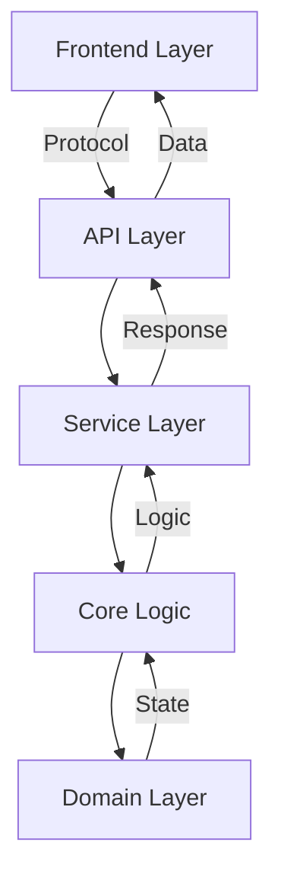

# Architecture Documentation

## Metadata
```yaml
last_updated: [YYYY-MM-DD]
version: [Version Number]
status: [Status]
primary_language: [Language]
framework: [Framework]
architecture_type: [Architecture Type]
documentation_type: Theory of Implementation
```

## Document Purpose
This document describes the architectural design of the [Project Name], providing a comprehensive overview of its structure, components, and implementation guidelines. It is specifically structured to facilitate AI understanding of the system architecture.

## System Overview
### Component Relationships


### Core Data Structures
```[language]
// Define core data structures here
type/class Structure1 {
    field1: Type
    field2: Type
}

type/class Structure2 {
    field1: Type
    field2: Type
}
```

## Component Architecture
### 1. Domain Layer
Location: `src/domain/`
```[language]
// Define domain interfaces/classes
interface Entity1 {
    // Core domain methods
}

class Implementation1 implements Entity1 {
    // Implementation details
}
```

Dependencies:
- None (core domain layer)

### 2. Core Logic
Location: `src/core/`
```[language]
// Define core business logic
class CoreLogic {
    // Core processing methods
    function process()
    function validate()
    function calculate()
}
```

Key Features:
- [Feature 1]
- [Feature 2]
- [Feature 3]

Dependencies:
- Domain Layer

### 3. Service Layer
Location: `src/service/`
```[language]
// Define service layer
class Service {
    // Service methods
    function operation1()
    function operation2()
    function operation3()
}
```

Key Features:
- Thread-safe operations
- State management
- Error handling
- Resource cleanup

Dependencies:
- Core Logic
- Domain Layer

### 4. API Layer
Location: `src/api/`

REST Endpoints:
```yaml
POST /api/resource:
  description: Create resource
  response: ResourceResponse

GET /api/resource/{id}:
  description: Get resource
  response: ResourceResponse

PUT /api/resource/{id}:
  description: Update resource
  request: UpdateRequest
  response: ResourceResponse
```

Key Features:
- Error handling
- API documentation
- Request validation
- Response formatting

Dependencies:
- Service Layer

### 5. Frontend
Location: `src/frontend/`

Component Structure:
```
frontend/
├── index.html     # Main UI
├── styles.css     # Styling
└── app.js         # Application logic
```

Key Features:
- User interface
- State management
- Event handling
- API integration

## Implementation Guidelines
### 1. Code Organization
```
src/
├── domain/       # Core entities
├── core/         # Business logic
├── service/      # Service layer
├── api/          # REST endpoints
└── frontend/     # UI components
```

### 2. Error Handling
```[language]
// Error handling pattern
try {
    // Operation
} catch (SpecificError) {
    // Handle specific case
} catch (Error) {
    // Handle general case
}
```

### 3. Testing Strategy
```[language]
// Test structure
class ComponentTest {
    @Test
    function given_condition_when_action_then_result()
    
    @Test
    function given_state_when_operation_then_outcome()
}
```

## AI-Specific Implementation Notes
### 1. State Management
- Immutable state transitions
- State validation
- History preservation
- Thread safety

### 2. Decision Points
- Validation: `CoreLogic.validate()`
- Processing: `CoreLogic.process()`
- State updates: `Service.updateState()`
- Response formatting: `API.formatResponse()`

### 3. Key Algorithms
```[language]
// Core algorithm template
function algorithm(input: Type): Result {
    // Validation
    validate(input)
    
    // Processing
    result = process(input)
    
    // State update
    updateState(result)
    
    return result
}
```

## Performance Considerations
### 1. Response Time Targets
- API Response: [target ms]
- Processing: [target ms]
- Updates: [target ms]

### 2. Resource Usage
- Memory per Operation: [limit]
- Connection Pool: [configuration]
- Thread Pool: [configuration]

## Implementation Status
All components require implementation:
- Domain Layer: [status]
- Core Logic: [status]
- Service Layer: [status]
- API Layer: [status]
- Frontend: [status]

## Task Tracking
See `project_tracking.md` for development progress and next steps.
