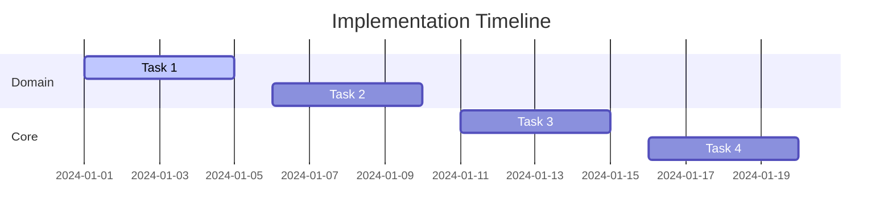

# Implementation State

## Metadata
```yaml
last_updated: [YYYY-MM-DD]
project_phase: [Phase]
overall_completion: [%]
critical_path: [Current Critical Path]
blocking_issues: [List or None]
documentation_version: [Version]
```

## Component Implementation Matrix
```yaml
components:
  domain_layer:
    status: [NOT_STARTED|IN_PROGRESS|COMPLETE]
    completion: [%]
    test_coverage: [%]
    files_implemented:
      - [file1.ext]: [Status]
      - [file2.ext]: [Status]
    next_actions:
      - [Action 1]
      - [Action 2]

  core_logic:
    status: [NOT_STARTED|IN_PROGRESS|COMPLETE]
    completion: [%]
    test_coverage: [%]
    files_implemented:
      - [file3.ext]: [Status]
      - [file4.ext]: [Status]
    next_actions:
      - [Action 3]
      - [Action 4]

  service_layer:
    status: [NOT_STARTED|IN_PROGRESS|COMPLETE]
    completion: [%]
    test_coverage: [%]
    files_implemented:
      - [file5.ext]: [Status]
      - [file6.ext]: [Status]
    next_actions:
      - [Action 5]
      - [Action 6]

  api_layer:
    status: [NOT_STARTED|IN_PROGRESS|COMPLETE]
    completion: [%]
    test_coverage: [%]
    files_implemented:
      - [file7.ext]: [Status]
      - [file8.ext]: [Status]
    next_actions:
      - [Action 7]
      - [Action 8]

  frontend:
    status: [NOT_STARTED|IN_PROGRESS|COMPLETE]
    completion: [%]
    test_coverage: [%]
    files_implemented:
      - [file9.ext]: [Status]
      - [file10.ext]: [Status]
    next_actions:
      - [Action 9]
      - [Action 10]
```

## Implementation Details

### 1. Domain Layer
```[language]
// Implemented Interfaces
interface Entity1 {
    // Core methods
}

interface Entity2 {
    // Core methods
}
```

Status: [Implementation status details]

### 2. Core Logic
```[language]
// Current Implementation State
class CoreLogic {
    // TODO: Implement core logic
    function process() {
        throw NotImplementedError()
    }
    
    // TODO: Implement validation
    function validate() {
        throw NotImplementedError()
    }
}
```

Status: [Implementation status details]

### 3. Service Layer
```[language]
// Current Implementation State
class Service {
    // TODO: Implement service methods
    function operation1() {
        throw NotImplementedError()
    }
}
```

Status: [Implementation status details]

### 4. API Layer
```[language]
// Current Implementation State
class APIController {
    // TODO: Implement endpoints
    function endpoint1() {
        throw NotImplementedError()
    }
}
```

Status: [Implementation status details]

## Test Coverage Matrix
```yaml
test_coverage:
  domain:
    unit_tests: [%]
    integration_tests: [%]
    files_needing_tests:
      - [file1.ext]
      - [file2.ext]

  core:
    unit_tests: [%]
    integration_tests: [%]
    files_needing_tests:
      - [file3.ext]
      - [file4.ext]

  service:
    unit_tests: [%]
    integration_tests: [%]
    files_needing_tests:
      - [file5.ext]
      - [file6.ext]

  api:
    unit_tests: [%]
    integration_tests: [%]
    files_needing_tests:
      - [file7.ext]
      - [file8.ext]
```

## Technical Debt Tracking
```yaml
technical_debt:
  current_issues:
    - type: [Issue Type]
      description: [Description]
      priority: [Priority]
      timeline: [Timeline]

    - type: [Issue Type]
      description: [Description]
      priority: [Priority]
      timeline: [Timeline]

  anticipated_issues:
    - type: [Issue Type]
      description: [Description]
      priority: [Priority]
      timeline: [Timeline]
```

## Implementation Timeline


## Next Implementation Steps
### Immediate Priority (Next 48 Hours)
1. [Task 1]
   - [Subtask 1.1]
   - [Subtask 1.2]

2. [Task 2]
   - [Subtask 2.1]
   - [Subtask 2.2]

### Short-term Priority (Next Week)
1. [Task 3]
   - [Subtask 3.1]
   - [Subtask 3.2]

2. [Task 4]
   - [Subtask 4.1]
   - [Subtask 4.2]

## Dependency Management
```yaml
dependencies:
  framework:
    name: [Framework]
    version: [Version]
    status: [Status]
    
  language:
    name: [Language]
    version: [Version]
    status: [Status]
    
  testing:
    name: [Framework]
    version: [Version]
    status: [Status]
```

## Resource Allocation
```yaml
resources:
  development:
    priority: [Priority]
    status: [Status]
    focus: [Focus Area]

  testing:
    priority: [Priority]
    status: [Status]
    focus: [Focus Area]

  documentation:
    priority: [Priority]
    status: [Status]
    focus: [Focus Area]
```

See `project_tracking.md` for detailed task breakdown and progress tracking.
